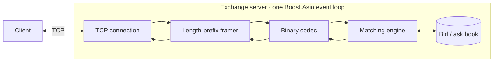

# Exchange Disruptor

Exchange Disruptor is a C++20 matching engine backed by an in-memory limit order book. It accepts limit, market, and cancel commands over TCP, applies price-time priority, and returns acknowledgements, rejections, and execution reports through a compact binary protocol.

The server owns one configured instrument, and every connected client trades against the same book. Network callbacks and matching are serialized on one Boost.Asio event loop, establishing a single processing order across all connections.

## Trading model

An incoming order always meets the best available price first. If several resting orders share that price, they execute in arrival order.

For a buy order, the engine starts at the lowest ask. For a sell order, it starts at the highest bid. Trades execute at the resting order's price, and each match produces two `Fill` events—one for the maker and one for the taker—with the same `matchId`, price, and quantity.

| Command | Engine behaviour | Result |
| --- | --- | --- |
| `Limit` | Matches while the opposite price crosses the limit; any remaining quantity rests on the book | Fill pairs followed by `Ack`, or `Reject` |
| `Market` | Sweeps available liquidity from the best price outward; unfilled quantity does not rest | `Ack` followed by zero or more fill pairs |
| `Cancel` | Locates a resting order by `orderId` and verifies its owner | `Ack`, `UnknownOrderId`, or `NotOwner` |

Price levels are held in ordered maps and orders within a level are held in FIFO lists. A separate `orderId` index points to each resting order, so cancellation does not require a scan of the book.

Prices and quantities use signed 64-bit integers. This keeps floating-point arithmetic out of the matching path and lets the calling application define its own fixed-point price scale.

## Request path



TCP is treated as a byte stream rather than a message transport. `Framer` retains incomplete input between reads and can extract several complete messages from a single read. `Codec` then turns each payload into a command before handing it to the matching engine. The resulting events follow the same path in reverse and are written to the connection that submitted the command.

## A trade from end to end

Consider an empty book configured for `ACME`:

1. Client 1 submits a limit order to sell 5 units at 100 (`orderId=1001`). Nothing crosses, so the order rests at the best ask and the server returns an `Ack`.
2. Client 2 submits a limit order to buy 5 units at 100 (`orderId=2002`). The incoming bid crosses the resting ask.
3. The engine executes 5 units at the maker's price of 100. It emits one fill for order `1001`, one fill for order `2002`, and an acknowledgement for the incoming order.
4. Both fills carry the same `matchId`; neither order remains on the book.

The process-level integration suite runs this exact scenario against a real server with two TCP clients.

## Build

### Requirements

- CMake 3.20 or newer
- C++20 compiler
- Boost headers, including Boost.Asio
- Unix Makefiles, as selected by the repository presets
- POSIX environment for process-level tests (`fork`, `waitpid`, and signals)

Install the build dependencies on macOS:

```bash
brew install cmake boost
```

Or on Debian and Ubuntu:

```bash
sudo apt-get install build-essential cmake libboost-all-dev
```

Configure, compile, and run the complete test suite:

```bash
git clone https://github.com/reavaquant/exchange-disruptor.git
cd exchange-disruptor

cmake --preset debug
cmake --build --preset debug -j
ctest --preset debug --output-on-failure
```

The same workflow is available through the `release` preset. Compiler warnings can be promoted to errors at configuration time:

```bash
cmake --preset debug -DEXCHANGE_DISRUPTOR_WARNINGS_AS_ERRORS=ON
cmake --build --preset debug -j
```

## Run the server

The default server listens on IPv4 port `9000` and creates a book for `ACME`:

```bash
./build/debug/exchange_disruptor server
```

The instrument, port, and IP version can be selected at startup:

```text
exchange_disruptor server [--port PORT] [--symbol SYMBOL] [--ipv4 | --ipv6]
```

For example:

```bash
./build/debug/exchange_disruptor server --port 9100 --symbol BTCUSD --ipv6
```

The process runs until it receives an external termination signal such as `Ctrl+C`.

## Connect a client

The repository exposes the TCP client as a C++ API. It resolves and connects asynchronously, queues commands while the connection is being established, frames outgoing payloads, and decodes incoming events.

```cpp
#include <boost/asio.hpp>
#include <memory>

#include "client/client.h"
#include "matching_engine/command/limit_command.h"

int main() {
    boost::asio::io_context io;
    Codec codec;

    auto client = Client::create(io, "127.0.0.1", 9000, codec);
    client->post(std::make_unique<LimitCommand>(
        1,          // clientId
        1001,       // orderId
        "ACME",     // symbol
        Side::Buy,
        10'000,     // price
        5           // quantity
    ));

    io.run();
}
```

The client is provided as a library rather than an interactive executable and is linked through the `exchange_disruptor_lib` CMake target.

## Wire protocol

Protocol v1 uses a four-byte big-endian payload length followed by the payload itself:

```text
+-------------------------+----------------------+
| payload length (u32 BE) | payload (0..1024 B) |
+-------------------------+----------------------+
```

Every multi-byte integer is encoded in network byte order. A symbol is encoded as an unsigned 8-bit byte length followed by the symbol bytes.

### Commands · client to server

All commands start with the same header:

```text
type:u8 | clientId:u64 | orderId:u64 | symbolLength:u8 | symbol:bytes
```

| Type | Value | Remaining payload |
| --- | ---: | --- |
| Limit | `1` | `price:i64 \| quantity:i64 \| side:u8` |
| Market | `2` | `quantity:i64 \| side:u8` |
| Cancel | `3` | none |

Sides are encoded as `Buy = 1` and `Sell = 2`.

### Events · server to client

All events start with:

```text
type:u8 | clientId:u64 | orderId:u64
```

| Type | Value | Remaining payload |
| --- | ---: | --- |
| Ack | `1` | none |
| Reject | `2` | `reason:u8` |
| Fill | `3` | `matchId:u64 \| price:i64 \| quantity:i64` |

Reject reasons are:

| Value | Reason |
| ---: | --- |
| `1` | `InvalidQuantity` |
| `2` | `InvalidPrice` |
| `3` | `UnknownSymbol` |
| `4` | `UnknownOrderId` |
| `5` | `NotOwner` |
| `6` | `InternalError` |

Invalid command payloads close only the offending connection. Oversized frames are discarded when their declared payload exceeds 1024 bytes.

## Verification

Three CTest targets cover the system at different boundaries:

| Test | Coverage |
| --- | --- |
| `exchange_disruptor.tests` | Price-time priority, partial and complete fills, market sweeps, cancellation, and rejection paths |
| `exchange_disruptor.tcp_v1.tests` | Codec round trips, fragmented frames, connection handling, and in-process TCP matching |
| `exchange_disruptor.tcp_v1.integration.tests` | Spawned server process, two-client crossing, event ordering, and isolation of malformed clients |

Run a single boundary with CTest's regular expression filter:

```bash
ctest --preset debug -R exchange_disruptor.tcp_v1.integration.tests -V
```

## Scope

The server's operating boundary is explicit:

| Area | Current behaviour |
| --- | --- |
| Instruments | One configured symbol per server process |
| State | In-memory order book; no journal or recovery |
| Scheduling | Network I/O and matching serialized on one Boost.Asio event loop |
| Client delivery | Events are returned on the connection that submitted the command |
| Risk and accounts | Outside the matching engine |
| Market data | No separate public feed |

## Repository layout

```text
.
├── include/exchange-disruptor/
│   ├── client/              # asynchronous TCP client
│   ├── matching_engine/     # commands, events, books, and matching rules
│   ├── protocol/            # binary codec and stream framing
│   └── server/              # listener and per-connection state
├── src/                     # implementations and process entry point
├── tests/
│   ├── unit/                # engine and TCP component tests
│   └── integration/         # real-process TCP tests
├── CMakeLists.txt
└── CMakePresets.json
```
