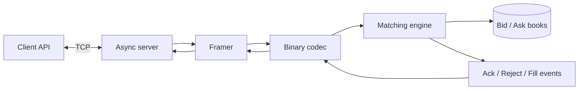

# Exchange Disruptor

> A compact C++20 exchange simulator built around a price-time-priority limit order book and an asynchronous binary TCP protocol.

Exchange Disruptor is an educational trading-systems project. Its current milestone implements the matching core and TCP v1 transport: clients submit limit, market, and cancel commands; the engine updates a single-symbol order book and returns acknowledgements, rejections, and fills.

## What is implemented

- Price-time priority: best price first, FIFO within a price level
- Limit orders with full fills, partial fills, and resting remainders
- Market orders that sweep multiple price levels
- Indexed cancellation by `orderId`, including ownership checks
- `Ack`, `Reject`, and paired maker/taker `Fill` events
- Length-prefixed binary protocol in network byte order
- Stateful frame reassembly across partial TCP reads
- Asynchronous, multi-connection TCP server and client API with Boost.Asio
- Unit, TCP component, and process-level integration tests

The project currently runs the network and matching logic on one Boost.Asio event loop. The SPSC ring buffers and multi-threaded Disruptor-style pipeline are the next milestone.

## Architecture



The book stores orders in price levels backed by FIFO lists. An `orderId` index points directly to resting orders, so cancellation does not scan the full book.

## Requirements

- CMake 3.20 or newer
- A C++20 compiler
- Boost headers, including Boost.Asio
- POSIX environment for the process-level integration test (`fork`, `waitpid`, and signals)
- Unix Makefiles, as configured by the included presets

On macOS with Homebrew:

```bash
brew install cmake boost
```

On Debian or Ubuntu:

```bash
sudo apt-get install build-essential cmake libboost-all-dev
```

## Build and test

```bash
git clone https://github.com/reavaquant/exchange-disruptor.git
cd exchange-disruptor

cmake --preset debug
cmake --build --preset debug -j
ctest --preset debug --output-on-failure
```

For an optimized build, replace `debug` with `release` in the three CMake commands.

Compiler warnings can optionally be promoted to errors:

```bash
cmake --preset debug -DEXCHANGE_DISRUPTOR_WARNINGS_AS_ERRORS=ON
cmake --build --preset debug -j
```

## Run the server

Start an IPv4 server for symbol `ACME` on port `9000`:

```bash
./build/debug/exchange_disruptor server
```

All server options are optional:

```text
exchange_disruptor server [--port PORT] [--symbol SYMBOL] [--ipv4 | --ipv6]
```

Example with custom settings:

```bash
./build/debug/exchange_disruptor server --port 9100 --symbol BTCUSD --ipv6
```

Stop the server with `Ctrl+C`.

## Use the client API

The current client is a library API rather than an interactive CLI. Commands can be posted before or after the asynchronous connection completes:

```cpp
#include <boost/asio.hpp>
#include <memory>

#include "client/client.h"
#include "matching_engine/command/limit_command.h"

int main() {
    boost::asio::io_context io;
    Codec codec;

    auto client = Client::create(io, "127.0.0.1", 9000, codec);
    client->post(std::make_unique<LimitCommand>(
        1,          // clientId
        1001,       // orderId
        "ACME",     // symbol
        Side::Buy,
        10'000,     // integer price
        5           // quantity
    ));

    io.run();
}
```

Prices and quantities are represented as signed 64-bit integers, avoiding floating-point arithmetic in the matching path. Applications can choose their own fixed-point price scale.

## Matching behaviour

| Command | Behaviour | Events |
| --- | --- | --- |
| `Limit` | Crosses compatible resting orders, then places any remainder on the book | Zero or more fill pairs, followed by `Ack`; invalid commands are rejected |
| `Market` | Consumes available liquidity from the best price outward; unmatched quantity expires | `Ack`, followed by zero or more fill pairs |
| `Cancel` | Removes a resting order through the internal index | `Ack`, or `Reject` if the order is unknown or owned by another client |

Each match produces one `Fill` for the resting order and one for the incoming order, both carrying the same `matchId`, execution price, and quantity. The execution price is the resting order's price.

### Reproducible crossing scenario

The process-level integration test launches a real server, connects two peers, and verifies this sequence:

1. Client 1 submits `SELL 5 @ 100` (`orderId=1001`) and receives an `Ack`.
2. Client 2 submits `BUY 5 @ 100` (`orderId=2002`).
3. The server emits two `Fill` events at price `100`, quantity `5`, with the same `matchId`, followed by an `Ack` for the incoming limit order.

Run only that integration suite with:

```bash
ctest --preset debug -R exchange_disruptor.tcp_v1.integration.tests -V
```

## TCP protocol v1

Every message uses the same frame envelope:

```text
+------------------------+----------------------+
| payload length (u32 BE)| payload (0..1024 B) |
+------------------------+----------------------+
```

Multi-byte fields use big-endian (network) byte order. Symbols are byte sequences prefixed by an unsigned 8-bit length.

### Commands: client to server

All command payloads begin with:

```text
type:u8 | clientId:u64 | orderId:u64 | symbolLength:u8 | symbol:bytes
```

| Type | Value | Additional fields |
| --- | ---: | --- |
| Limit | `1` | `price:i64 \| quantity:i64 \| side:u8` |
| Market | `2` | `quantity:i64 \| side:u8` |
| Cancel | `3` | none |

Sides are `Buy = 1` and `Sell = 2`.

### Events: server to client

All event payloads begin with:

```text
type:u8 | clientId:u64 | orderId:u64
```

| Type | Value | Additional fields |
| --- | ---: | --- |
| Ack | `1` | none |
| Reject | `2` | `reason:u8` |
| Fill | `3` | `matchId:u64 \| price:i64 \| quantity:i64` |

Reject reasons are `InvalidQuantity = 1`, `InvalidPrice = 2`, `UnknownSymbol = 3`, `UnknownOrderId = 4`, `NotOwner = 5`, and `InternalError = 6`.

Invalid command payloads close the offending connection without stopping the server. Frame payloads are capped at 1024 bytes; oversized frames are discarded by the framer.

## Tests

CTest registers three suites:

- `exchange_disruptor.tests` — matching and order-book behaviour
- `exchange_disruptor.tcp_v1.tests` — codec, framing, and in-process TCP behaviour
- `exchange_disruptor.tcp_v1.integration.tests` — real server process with multiple clients

List or run them individually:

```bash
ctest --preset debug -N
ctest --preset debug -R exchange_disruptor.tests -V
ctest --preset debug -R exchange_disruptor.tcp_v1.tests -V
```

## Repository layout

```text
.
├── include/exchange-disruptor/
│   ├── client/              # asynchronous client API
│   ├── matching_engine/     # commands, events, book, and matching
│   ├── protocol/            # binary codec and TCP framing
│   └── server/              # listener and per-client connections
├── src/                     # implementations and server entry point
├── tests/
│   ├── unit/                # engine and TCP component tests
│   └── integration/         # spawned-server end-to-end tests
├── docs/subject/            # original project brief
├── CMakeLists.txt
└── CMakePresets.json
```

The original assignment is available as [docs/subject/main.pdf](docs/subject/main.pdf).

## Roadmap

- Add fixed-capacity SPSC ring buffers for command and event buses
- Move matching onto a dedicated thread
- Route events back to their owning client session
- Add an interactive command-line client
- Add latency and throughput benchmarks
